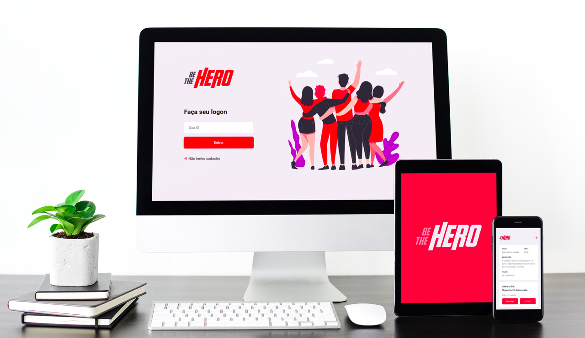

<h1 align="center">
    
</h1>

<h4 align="center"> 
	:heavy_check_mark: 🚀 Semana OmniStack 11.0 :heavy_check_mark:
</h4>
<p align="center">
  

  
	
  <a href="https://www.linkedin.com/in/danielobara/">
    
  </a>

  <a href="https://github.com/DanielObara/SemanaOmnistack11/commits/master">
    
  </a>

<a aria-label="Completed" href="https://rocketseat.com.br/week-10/aulas#4">
    </img>
  </a>
  
   <a href="https://github.com/DanielObara/SemanaOmnistack11/stargazers">
    
  </a>
</p>
<p align="center">
  <a href="https://insomnia.rest/run/?label=SemanaOmnistack11&uri=https%3A%2F%2Fraw.githubusercontent.com%2FDanielObara%2FSemanaOmnistack11%2Fmaster%2FInsomnia_2020-03-24.json" target="_blank"></a>
</p>
<p align="center">
  <a href="#-project">Project</a>&nbsp;&nbsp;&nbsp;|&nbsp;&nbsp;&nbsp;
  <a href="#rocket-Technologies">Technologies</a>&nbsp;&nbsp;&nbsp;|&nbsp;&nbsp;&nbsp;
  <a href="#-layout">Layout</a>&nbsp;&nbsp;&nbsp;|&nbsp;&nbsp;&nbsp;
  <a href="#-how-to-use">How to use</a>&nbsp;&nbsp;&nbsp;|&nbsp;&nbsp;&nbsp;
  <a href="#-how-to-contribute">How to contribute</a>&nbsp;&nbsp;&nbsp;|&nbsp;&nbsp;&nbsp;
  <a href="#memo-license">License</a>
</p>

## 💻 Project

Be The Hero is a project that aims to connect people who are willing to help ONGs.

<h1 align="center">
    
</h1>


## :rocket: Technologies

This project was developed with the following technologies:

- [Node.js](https://nodejs.org/en/) 
- [React](https://reactjs.org)
- [React Native](https://facebook.github.io/react-native/)
- [Expo](https://expo.io/)

## 🔖 Layout

Para acessar o layout utilize a ferramenta [Figma](https://www.figma.com/file/2C2yvw7jsCOGmaNUDftX9n/Be-The-Hero---OmniStack-11?node-id=0%3A1).

## :information_source: How To Use

To clone and run this application, you'll need [Git](https://git-scm.com), [Node.js][nodejs] + [Yarn][yarn] installed on your computer.

From your command line:

### Install API
```bash
# Clone this repository
$ git clone https://github.com/DanielObara/SemanaOmnistack11

# Go into the repository
$ cd SemanaOmnistack11/backend

# Install dependencies
$ yarn install

# Run Migrates
$ yarn knex migrate:latest 

# Run Seeds
$ yarn seed

# Run the API
$ yarn dev

# Run tests
$ yarn test
```

## 🤔 How to contribute

- Make a fork;
- Create a branck with your feature: `git checkout -b my-feature`;
- Commit changes: `git commit -m 'feat: My new feature'`;
- Make a push to your branch: `git push origin my-feature`.

After merging your receipt request to done, you can delete a branch from yours.

## :memo: License

This project is under the MIT license. See the [LICENSE](LICENSE.md) for details.

---

Made with ♥ by Daniel Obara :wave: [Get in touch!](https://www.linkedin.com/in/danielobara/)

[nodejs]: https://nodejs.org/
[yarn]: https://yarnpkg.com/
[vc]: https://code.visualstudio.com/
[vceditconfig]: https://marketplace.visualstudio.com/items?itemName=EditorConfig.EditorConfig
[vceslint]: https://marketplace.visualstudio.com/items?itemName=dbaeumer.vscode-eslint
[prettier]: https://marketplace.visualstudio.com/items?itemName=esbenp.prettier-vscode
